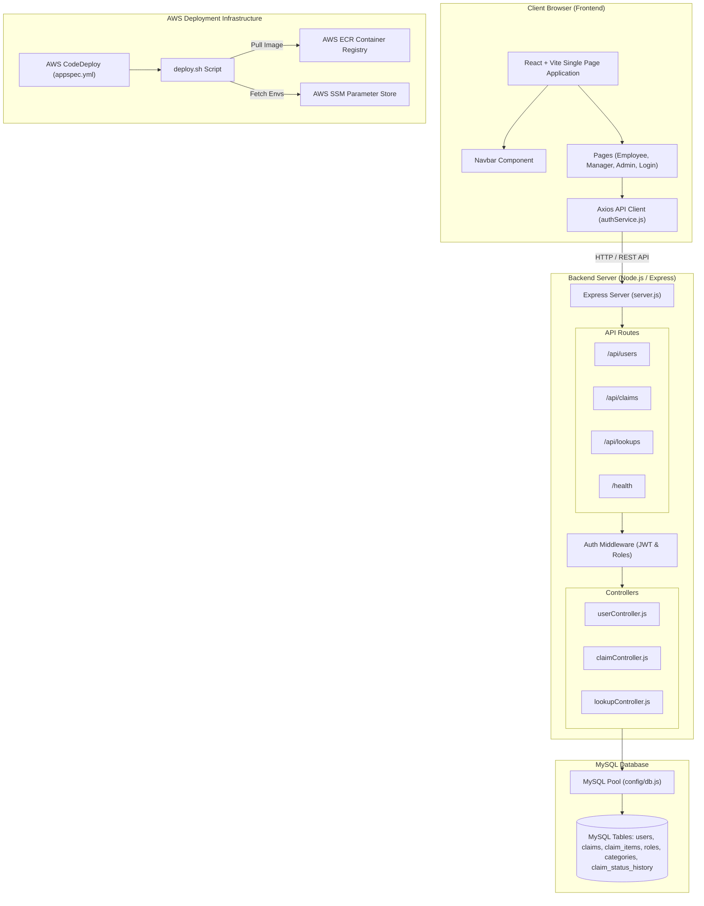
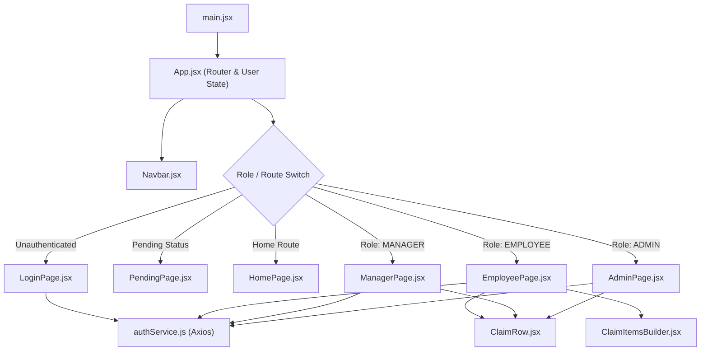
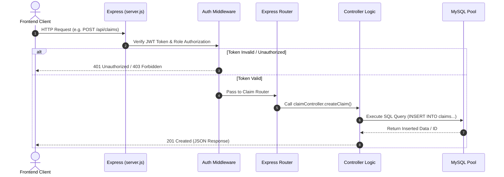

# 🗺️ Project Structure & Architecture Overview

This document provides a visual and graphical overview of the project directory structure, component hierarchy, and architectural flow. **This file should be kept updated whenever new files, directories, or architectural components are added or modified.**

---

## 🌳 Directory Tree Visual

```
.
├── 📄 PROJECT_STRUCTURE.md    # Graphical project structure and documentation
├── 📄 appspec.yml            # AWS CodeDeploy deployment hooks & specs
├── 📄 docker-compose.yml     # Docker container orchestration for backend & database
├── 📁 scripts/
│   └── 📄 deploy.sh          # AWS CodeDeploy deployment script (ECR pull, SSM env, container restart)
├── 📁 backend/
│   ├── 📄 .dockerignore      # Files ignored in backend Docker build context
│   ├── 📄 .env               # Active backend environment variables (local)
│   ├── 📄 .env.example       # Template for backend environment variables
│   ├── 📄 .gitignore          # Backend Git ignore rules
│   ├── 📄 Dockerfile         # Docker multi-stage build instructions (Node 18 Alpine)
│   ├── 📄 buildspec.yml      # AWS CodeBuild configuration for backend Docker image
│   ├── 📄 package.json       # Backend Node.js dependencies & scripts
│   ├── 📄 package-lock.json  # NPM dependency lockfile
│   ├── 📁 db/
│   │   ├── 📄 init_db.js     # Script to execute schema & seed migration on MySQL
│   │   ├── 📄 schema.sql     # Database tables DDL (users, claims, claim_items, etc.)
│   │   ├── 📄 seed.sql       # Initial reference data DML (roles, categories, demo users)
│   │   └── 📄 test_verify.js # Test script for database connection & query validation
│   └── 📁 src/
│       ├── 📄 server.js      # Express server entry point, CORS, and route mounting
│       ├── 📁 config/
│       │   └── 📄 db.js      # MySQL connection pool configuration (mysql2/promise)
│       ├── 📁 controllers/
│       │   ├── 📄 claimController.js  # Expense claim CRUD, status workflow & metrics
│       │   ├── 📄 lookupController.js # Categories and status reference data handlers
│       │   └── 📄 userController.js   # Auth (login/register) and user administration
│       ├── 📁 middleware/
│       │   └── 📄 authMiddleware.js   # JWT authentication & role-based access control
│       └── 📁 routes/
│           ├── 📄 claimRoutes.js  # `/api/claims` endpoint routes
│           ├── 📄 healthRoutes.js # `/health` endpoint for AWS/ALB health checks
│           ├── 📄 lookupRoutes.js # `/api/lookups` endpoint routes
│           └── 📄 userRoutes.js   # `/api/users` and `/api/auth` endpoint routes
└── 📁 frontend/
    ├── 📄 .env               # Active frontend environment variables (local)
    ├── 📄 .env.example       # Template for frontend environment variables
    ├── 📄 .gitignore          # Frontend Git ignore rules
    ├── 📄 README.md          # Frontend development quickstart guide
    ├── 📄 buildspec.yml      # AWS CodeBuild configuration for Vite static build
    ├── 📄 eslint.config.js   # ESLint code style and syntax rules
    ├── 📄 index.html         # Main HTML template & root DOM container
    ├── 📄 package.json       # Frontend React & Vite dependencies
    ├── 📄 package-lock.json  # NPM dependency lockfile
    ├── 📄 vite.config.js     # Vite bundler configuration
    ├── 📁 dist/              # Production compiled static web assets
    ├── 📁 public/            # Static public assets (favicons, icons)
    └── 📁 src/
        ├── 📄 main.jsx       # React application entry point (DOM render)
        ├── 📄 App.jsx        # Root component, routing logic & global application state
        ├── 📄 App.css        # Layout styles & component-specific CSS
        ├── 📄 index.css      # Design system, CSS variables & theme tokens
        ├── 📁 assets/        # Media assets, icons & graphics
        ├── 📁 components/
        │   ├── 📄 ClaimItemsBuilder.jsx # Dynamic form for adding claim item details
        │   ├── 📄 ClaimRow.jsx          # Reusable claim card/table row component
        │   └── 📄 Navbar.jsx            # Top navigation header with user info & logout
        ├── 📁 pages/
        │   ├── 📄 AdminPage.jsx     # System admin view (user management, payouts, metrics)
        │   ├── 📄 EmployeePage.jsx  # Employee dashboard (view & submit expense claims)
        │   ├── 📄 HomePage.jsx      # Role-based landing dashboard
        │   ├── 📄 LoginPage.jsx     # User authentication (Login & Register) interface
        │   ├── 📄 ManagerPage.jsx   # Manager review dashboard (approve/reject team claims)
        │   └── 📄 PendingPage.jsx   # Account holding page for pending approvals
        └── 📁 services/
            └── 📄 authService.js    # Axios HTTP client & backend API integrations
```

---

## 📊 Graphical System Architecture Diagram



---

## 🧩 Frontend Component & Routing Diagram



---

## 🔄 Backend API Request Sequence Diagram



---

## 📁 Detailed Directory & File Reference

### 1. Workspace Root Directory (`/`)
- `PROJECT_STRUCTURE.md`: Graphical structure diagrams, component hierarchy, and maintenance documentation.
- `appspec.yml`: AWS CodeDeploy deployment lifecycle specification.
- `docker-compose.yml`: Container orchestration setup for local/staging server and database.
- `scripts/deploy.sh`: Automated deployment script executing ECR container pull and SSM secret fetching.

### 2. Backend Subsystem (`/backend`)
- **`db/`**:
  - `schema.sql`: Table structure (Users, Roles, Categories, Claims, Claim Items, Audit History).
  - `seed.sql`: Data seeding script for initial setup and testing.
  - `init_db.js`: Execution script for schema creation and seeding.
  - `test_verify.js`: Verification test for DB connection and CRUD validation.
- **`src/`**:
  - `server.js`: Express server startup, CORS, middleware, and route mounting.
  - `config/db.js`: Database MySQL connection pool initialization.
  - `controllers/`: Business logic handlers (`claimController.js`, `userController.js`, `lookupController.js`).
  - `middleware/authMiddleware.js`: Token validation & role permission enforcement.
  - `routes/`: Express API route modules (`userRoutes.js`, `claimRoutes.js`, `lookupRoutes.js`, `healthRoutes.js`).

### 3. Frontend Subsystem (`/frontend`)
- **`src/components/`**:
  - `Navbar.jsx`: Header bar displaying user information and logout controls.
  - `ClaimRow.jsx`: Reusable claim card/table row component.
  - `ClaimItemsBuilder.jsx`: Form builder for itemized claim entries.
- **`src/pages/`**:
  - `LoginPage.jsx`: User authentication screen (Login & Register).
  - `EmployeePage.jsx`: Employee expense submission and tracking screen.
  - `ManagerPage.jsx`: Manager approval & rejection workflow screen.
  - `AdminPage.jsx`: System administration dashboard for user management & payouts.
  - `PendingPage.jsx`: Holding view for accounts awaiting admin approval.
  - `HomePage.jsx`: Role-based landing dashboard.
- **`src/services/`**:
  - `authService.js`: Centralized Axios client for backend API communication.

---

## 🔄 Maintenance & Update Guidelines

Whenever files or directories are added, renamed, or deleted in this project:
1. **Directory Tree**: Update the ASCII directory tree in Section 1.
2. **Mermaid Diagrams**: Update the architecture or component flow diagrams in Sections 2, 3, or 4 if components, routes, or workflows change.
3. **Reference Descriptions**: Update file descriptions in Section 5.
